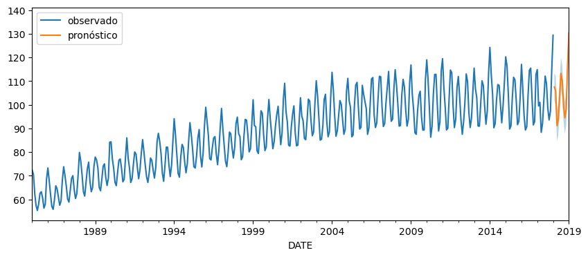

# Predicción de Producción Eléctrica (1985-2018) con SARIMA + Simulated Annealing
> Caso práctico del módulo de **Optimización, Series Temporales y Grafos** – Máster IMF



---

## 📑 Descripción

Este repositorio contiene el código y los recursos necesarios para:

1. **Explorar y preparar** la serie temporal mensual de producción eléctrica de EE. UU. (`electric_production.csv`, 1985-2018).  
2. **Construir un modelo SARIMA** que capture tendencia y estacionalidad anual.  
3. **Optimizar los parámetros** `p, d, q, P, D, Q` mediante un algoritmo propio de **Simulated Annealing (SA)** sobre un grafo de vecindad.  
4. **Validar** el modelo con un bloque de 50 meses y la métrica **RMSE**, penalizando toda configuración con residuos autocorrelados (Ljung-Box ≤ lag 6).  
5. **Generar pronósticos** de 12 meses y evaluar los residuos con ACF, PACF, Q-Q y pruebas estadísticas.

---

## 🗂️ Estructura del proyecto

```
.
├── data/
│   └── electric_production.csv       # Serie original (NO incluida en el repo por ser privada)
├── notebooks/
│   └── 01_dclt_sarima_sa.ipynb       # Notebook principal (EDA → SA → Forecast)
├── docs/
│   └── img/output.png      # Ejemplo de salida gráfica
├── requirements.txt
└── README.md
```

> **Nota:** El archivo `electric_production.csv` es privado y no se encuentra en este repositorio.

---

## ⚙️ Requisitos

* Python ≥ 3.9  
* Dependencias (se instalan con `pip install -r requirements.txt`):

  ```
  pandas
  numpy
  matplotlib
  scikit-learn
  statsmodels
  networkx
  jupyter
  ```

> **Nota:** se recomienda uso de entorno virtual (`venv` o `conda`) y JupyterLab.

---

## 🏃‍♂️ Uso rápido

```bash
# 1. Clona el repo
git clone https://github.com/DiegoLerma/sarima-sa.git
cd sarima-sa

# 2. Crea entorno e instala dependencias
python -m venv .venv
source .venv/bin/activate        # Windows: .venv\Scripts\activate
pip install -r requirements.txt

# 3. Lanza el notebook
jupyter lab notebooks/01_dclt_sarima_sa.ipynb
```

El notebook guía paso a paso:

1. EDA y tests de estacionariedad  
2. Construcción del grafo de soluciones  
3. Simulated Annealing (30 iteraciones, `T0=10`)  
4. Selección del mejor nodo → ajuste final → pronóstico 12 m  
5. Diagnóstico de residuos

Al finalizar obtendrás una gráfica similar a la mostrada arriba y el resumen estadístico del modelo.

---

## 📈 Resultados clave

| Métrica | Valor |
|---------|-------|
| **Modelo óptimo** | SARIMA **(1, 1, 1)×(0, 1, 0, 12)** |
| **RMSE (validación 50 m)** | 4.27 |
| **Ljung-Box (lag ≤ 6)** | p = 0.136 ✓ |
| **AIC** | 1911.9 |
| **Observación** | Residuos sin autocorrelación, colas levemente pesadas (JB ≠ N) |

---

## 🔬 Posibles mejoras

* Aumentar iteraciones SA y lanzar múltiples *multi-starts*  
* Permitir saltos ±2 en el grafo para escapar de óptimos locales  
* Transformación logarítmica para estabilizar varianza y colas largas  
* Estimar intervalos vía bootstrap de residuos en lugar de asunción normal  
* Integrar un paso de **walk-forward validation** en lugar de hold-out fijo

---

## 👤 Autor

**Diego Cesar Lerma Torres** – Médico & Desarrollador IA  
Contacto: diego@neuroglias.com • [LinkedIn](https://www.linkedin.com/in/diego-lerma/)

---

## 📄 Licencia

Este proyecto se distribuye bajo licencia **MIT**. Consulta el archivo `LICENSE` para más información.